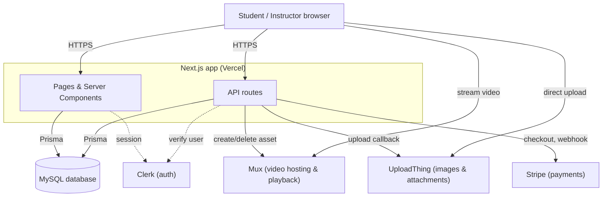

# AcademyX

A full-stack e-learning platform built with Next.js. Instructors publish courses with chaptered video lessons, students track their progress chapter by chapter, and purchases are handled through Stripe.

## Features

- Public landing page, with courses browsable before signing in
- Course creation for instructors: title, description, image, category, price, chapters
- Video lessons via Mux, with per-chapter progress tracking
- File attachments per course via UploadThing
- Purchases and checkout via Stripe
- Authentication via Clerk

## Tech stack

- **Framework:** Next.js 15 (App Router)
- **Database:** MySQL, via Prisma ORM
- **Auth:** Clerk
- **Video:** Mux
- **File uploads:** UploadThing
- **Payments:** Stripe
- **Styling:** Tailwind CSS, shadcn/ui

## Architecture



## Getting started locally

```bash
npm install
cp .env.example .env   # fill in your own keys
npx prisma migrate dev
npm run dev
```

## License

MIT, see [LICENSE](./LICENSE).
